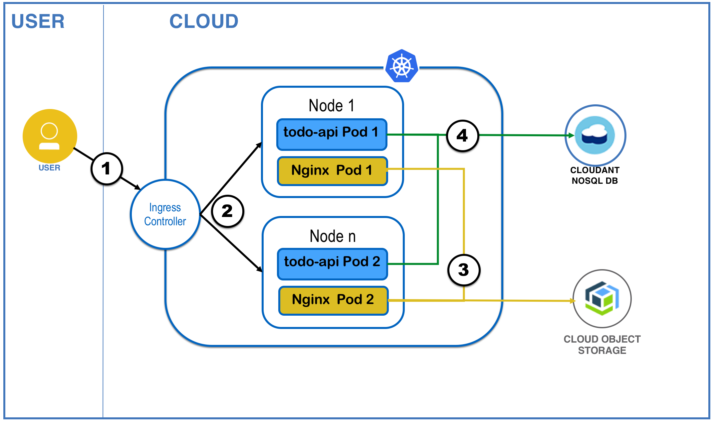
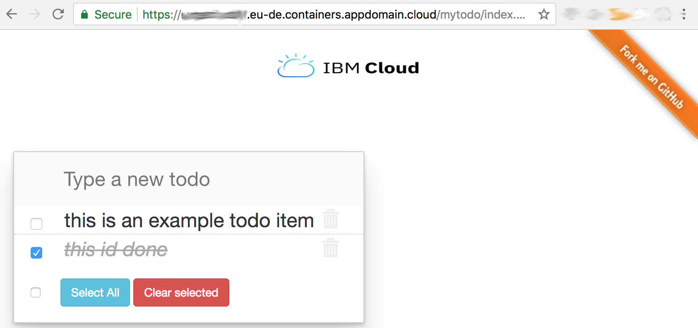

# todo-2018
Example Todo application on Kubernetes using ASP Core .NET 2.1, Cloudant NoSQL DB  and IBM Cloud Object Storage 

## Description
This is a small todo application with the following components:
* Cloudant NoSQL Database => storage of todo items
* ASP Core .NET 2.1 REST Service => microservice for CRUD of todo items
* IBM Cloud Object Storage  => S3 compatible storage of static webfile content with private HMAC bucket credentials
* OpenResty/NGINX Caching Webserver => caching static webcontent proxy for api


1. The user sends a request to the public endpoint application which is represented by an Ingress application load balancer that load balances incoming network traffic across app pods in the cluster. 
2. The loadbalancer forwards to one of the available Pods of the deployed Services.
3. They NGINX/OpenResty Pods accessing the Cloud Object Storage bucket via HMAC Authorization and caching the webcontent.
4. The ASP.NET Core 2.1 todo-api provides a REST interface for CRUD operations of TODO items and is accessing the Cloudant NoSQL DB.


## Prerequisites:
* Paid IBM Cloud Kubernetes Custer
* local git, docker and kubectl CLIs installed
* IBM Cloud Object Storage Instance with bucket and HMAC credentials https://console.bluemix.net/docs/services/cloud-object-storage/hmac/credentials.html#using-hmac-credentials
* s3cmd installed, separate configuration not needed, everything needed will be passed by 01_s3sync.sh script http://s3tools.org/s3cmd

## Installation on IBM Cloud Kuberntes Service
1. clone this repo
```shell
git clone https://github.com/cloud-dach/todo-2018.git
```
2. create environment source file
```shell
cp env.local.sample env.local
```
4. adjust settings in env.local to match your COS and Kubernetes Settings
5. Sync static webcontent to your bucket
```shell
./01_s3sync.sh
```
6. Build and push the Docker images for the ASP.NET Core and NGINX Service to the IBM Cloud Container Registry
```shell
./02_buildimages.sh
```
7. Create a Lite Plan Cloudant NoSQL Db via the ibmcloud cli
```shell
./03_createdb.sh
```
8. bind the cloudant credentials as kubernetes secrets in the cluster
```shell
./04_servicebind.sh
```
9. generate deploy2kube.yaml from template (please review the generated file)
```shell
./05_deploy.sh
```
10. deploy to kubernetes
```shell
kubectl create -f deploy2kube.yaml
```
11. Review the deployed items
```shell
kubectl describe ingress todo-app
```
12. Open the application in the Browser based on the output from the todo-app ingress information
https://YOURCLUSTERSUBDOMAIN.DOMAIN/mytodo/index.html


